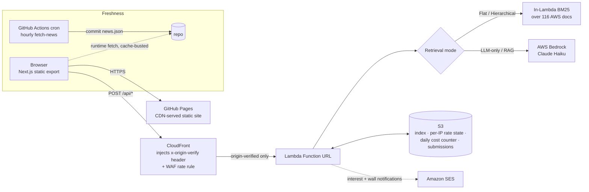

# ragornot

**Does RAG actually earn its cost? Measure it live, don't guess.**

[](https://github.com/Raxorr/ragornot/actions/workflows/deploy.yml)
[](LICENSE)
[](https://ragornot.com)
[](https://nextjs.org)
[](https://www.typescriptlang.org)
[](https://aws.amazon.com)

**Live demo → https://ragornot.com**

---

## The problem it solves

"Should we use RAG or just call the model?" is one of the most common architecture
questions in applied AI — and it's almost always answered by assertion, not measurement.
People hand-wave the cost and treat retrieval quality as binary.

**ragornot answers it empirically.** It runs the *same* query through four retrieval
strategies against a live serverless backend and reports, side by side:

- **latency** (measured end-to-end in the browser),
- a **retrieval relevance proxy** (BM25 lexical-match confidence — explicitly not answer correctness),
- **cost per query** (real AWS Bedrock token billing), and
- **energy / water / CO₂ estimates** with uncertainty bands and sensitivity controls, projected to org scale (1k–100k queries/day).

Every metric is badged **measured** (from the Bedrock API) or **modeled — estimate**
(literature-derived coefficients) so a reader never mistakes a proxy for a measurement.

The result is a concrete, reproducible view of when RAG's extra cost and latency are
justified — and when lexical retrieval is already good enough.

---

## Architecture



**Request lifecycle in one line:** the browser talks only to CloudFront; CloudFront adds a
secret `x-origin-verify` header and forwards to the Lambda Function URL, which the Lambda
rejects unless the header matches — so the Function URL can't be called directly even
though CORS is open. See [ARCHITECTURE.md](ARCHITECTURE.md) for the design decisions and
tradeoffs.

---

## Engineering highlights

- **Four retrieval modes on one query.** Flat (global BM25), Hierarchical (document →
  section → chunk narrowing), LLM-only (ungrounded Bedrock baseline), and RAG (retrieval +
  generation) — scored on the same metrics so the comparison is apples-to-apples. Winner
  logic is quality-proxy first, latency as tiebreaker, with an explicit "tie" band.
- **Honest metric framing.** The retrieval score is labelled "relevance (proxy)" — a BM25
  lexical-match confidence, not answer correctness. Every metric is badged **measured**
  (latency, tokens, cost from Bedrock) or **modeled — estimate** (energy, water, CO₂ from
  literature coefficients). End-answer evaluation (correctness, faithfulness, citation
  quality) against a golden set is a documented future metric.
- **Token-based environmental derivation.** Energy is derived from token count via a cited
  per-token coefficient (Epoch AI, 0.6 Wh/1k tokens), not from dollar cost. CO₂ = energy ×
  grid intensity; water = energy-scaled full-scope figure (Jegham et al.). Every modeled
  figure shows low/mid/high uncertainty bands from the source's range endpoints.
- **Three-axis sensitivity controls.** Grid carbon intensity (50–480 gCO₂/kWh, Ember/IEA),
  PUE (1.1–1.58×, Uptime Institute), and per-token energy (0.1–0.6 Wh, Epoch AI) are
  user-adjustable — all modeled figures recompute live.
- **Per-mode distributions.** The aggregate reports min / median / max / σ per mode for
  latency, cost, and relevance — not just means. Includes an honest n=7 caveat and a note
  that significance testing requires the planned 50–100 question golden set.
- **Run metadata for reproducibility.** Every benchmark result stamps model ID, pricing
  version, run timestamp, corpus size, and query count. Fields the Lambda doesn't yet
  return (corpus version, prompt version, cold/warm) are shown as "not reported" with TODOs.
- **Deterministic decision tool.** `/decide` is an 8-question client-side decision tree
  that recommends RAG, lexical search, long-context, fine-tuning, or no AI — each with a
  "why this answer" trace and cost/energy tradeoff. Crawlable prose answer + FAQ + FAQPage
  and WebApplication JSON-LD for answer-engine optimisation (AEO).
- **Origin-locked backend.** CloudFront injects an `x-origin-verify` secret server-side;
  the secret never ships in the client bundle. The Lambda Function URL is public but
  useless without it. This is the real access-control boundary, independent of CORS.
- **Cost is bounded by construction.** S3-backed per-IP daily rate limits, plus a
  **global daily Bedrock USD cap** that acts as a circuit breaker — once the day's spend
  ceiling is hit, generative modes stop until UTC midnight. Backed by AWS-side WAF rate
  rules, AWS Budgets alerts, and reserved concurrency so a traffic spike can't run up a bill.
- **State persistence across navigation.** Benchmark and Explore results live in root-layout
  React context providers (survive tab switches); last successful run is persisted to
  `sessionStorage` (survives accidental refresh). Rate limits stay server-authoritative.
- **Freshness without a rebuild.** An hourly GitHub Actions cron fetches and commits
  `news.json`; the News tab fetches that committed file from GitHub raw at runtime with
  cache-busting, so a hard refresh shows the latest feed without waiting for a Pages deploy.
- **Moderated community wall.** Anonymous submissions POST to a Lambda endpoint that
  validates, profanity-filters, per-IP rate-limits, stores to S3, and notifies the owner via
  SES. Nothing is auto-published — entries appear only after manual approval.
- **Static-first, serverless-only.** No servers, no database to babysit: a static Next.js
  export on GitHub Pages in front of a single Lambda + S3 + Bedrock. Cheap at idle, and the
  blast radius of any one component is small.

---

## Routes

| Route | Description |
|-------|-------------|
| [`/benchmark`](https://ragornot.com/benchmark) | Live multi-query benchmark — runs 7 queries through all 4 modes, reports per-query cards, aggregate with distributions, Mode Comparison table, Impact Analytics v2 (energy/water/CO₂ with uncertainty bands + sensitivity), and a shareable result card |
| [`/explore`](https://ragornot.com/explore) | Interactive search over 116 AWS docs with mode selector and live results. LLM/RAG free tier: 10/day per IP |
| [`/decide`](https://ragornot.com/decide) | 8-question "Do I need RAG?" decision tool → RAG / lexical / long-context / fine-tuning / no-AI, each with tradeoff + "why this answer" trace. Crawlable prose answer + FAQ + JSON-LD (AEO) |
| [`/news`](https://ragornot.com/news) | Hourly-aggregated AI/RAG/LLM/cost/sustainability feed (arXiv, HN, publisher RSS) with source, topic, and time filters |
| [`/digest`](https://ragornot.com/digest) | "RAG Reality Check" weekly digest — 3 things that happened, impact stat of the week, community question → /wall. Email notify-me via SES |
| [`/wall`](https://ragornot.com/wall) | "In the Wild" — anonymous, moderated community wall of real-world AI use cases |
| [`/methodology`](https://ragornot.com/methodology) | Every energy/water/CO₂ coefficient with its cited source, the exact formulas, measured-vs-modeled distinction, uncertainty & sensitivity documentation, scope-1 vs full-scope water, statistical limitations, and honest caveats |

### Retrieval modes

| Mode | Description |
|------|-------------|
| **Flat (Lexical)** | Global BM25-style ranking across every chunk. Free — no LLM call. |
| **Hierarchical** | Document → section → chunk narrowing before ranking. Free — no LLM call. |
| **LLM-only** | Direct AWS Bedrock (Haiku) answer, no retrieval grounding. ~$0.00013/query. |
| **RAG** | Hierarchical retrieval + Bedrock generation. Highest retrieval relevance, ~$0.00041/query. |

---

## Local dev

```bash
cp .env.example .env.local
# Edit .env.local: set NEXT_PUBLIC_API_BASE_URL to your CloudFront domain
npm install
npm run dev
# Open http://localhost:3000
```

The app redirects `/` to `/benchmark` (the core). Other routes: `/explore`, `/decide`,
`/news`, `/digest`, `/wall`, `/methodology`.

Regenerate the social-preview card after changing the wordmark/tagline:

```bash
node scripts/generate-og-image.mjs   # writes public/og-image.png (1200×630)
```

---

## Environment variables

| Variable | Required | Description |
|----------|----------|-------------|
| `NEXT_PUBLIC_API_BASE_URL` | Yes | CloudFront domain that proxies to the Lambda backend |
| `NEXT_PUBLIC_SITE_URL` | No | Absolute site URL for canonicals + OG tags (default: `https://ragornot.com`). Everything derives from it, so a domain change is a one-line edit |

**Security note:** the `x-origin-verify` header that protects the Lambda is injected
**server-side by CloudFront** — it never appears in client code or env files.

### Lambda backend env vars (set in AWS console/CLI, never in this repo)

| Variable | Description |
|----------|-------------|
| `DATA_BUCKET` | S3 bucket for benchmark index, interest + wall submissions, quota/rate state |
| `BENCHMARK_KEY` | Secret key for advanced-benchmark access (user-typed, sent as header) |
| `ORIGIN_VERIFY_SECRET` | Must match the `x-origin-verify` CloudFront custom header |
| `SES_SENDER` | Verified SES address for outbound email |
| `OWNER_EMAIL` | Owner notification address for interest + wall submissions |
| `SES_REGION` | AWS region where the SES identity is verified (default: us-east-1) |
| `EXPLORE_LLM_FREE_DAILY` | Max Explore AI answers per IP per day (default: 10) |
| `BENCHMARK_DAILY_LIMIT` | Max benchmark runs per IP per day |
| `BEDROCK_DAILY_USD_CAP` | Hard global Bedrock spend cap in USD per UTC day (circuit breaker) |
| `BEDROCK_MODEL_ID` | Bedrock model for LLM/RAG (e.g. claude-haiku-4-5) |

---

## News cron

The news feed lives in `public/news.json`. Updated by `.github/workflows/news-cron.yml`
every hour:

1. Actions runs `npm run fetch-news`
2. If `news.json` changed, it commits and pushes to `main`
3. The push triggers `deploy.yml`, which rebuilds and redeploys

The News tab also **fetches the committed `news.json` from GitHub raw at runtime** (with
cache-busting), so a page load / hard refresh reflects the latest hourly commit without
waiting for a Pages rebuild.

> **Note:** GitHub's scheduled workflows can lag 15–60 min under load. For tighter
> freshness, an external cron (e.g. [cron-job.org](https://cron-job.org)) can POST a
> `workflow_dispatch` to the `news-cron.yml` workflow with a PAT scoped to `actions:write`.

Local: `npm run fetch-news`. To add a source: edit `RSS_SOURCES` in `scripts/fetch-news.mjs`.

---

## Deploy to GitHub Pages

`.github/workflows/deploy.yml` handles this automatically on every push to `main`.

**One-time setup:**
1. Repo Settings → Pages → Source: **GitHub Actions**
2. Push to `main`

Build env vars set in the workflow:
```
NEXT_PUBLIC_API_BASE_URL=https://d8mkun1yo4v0c.cloudfront.net
NEXT_PUBLIC_SITE_URL=https://ragornot.com
```

The custom domain is pinned by `public/CNAME` (`ragornot.com`), which the static
export copies into `out/` on every deploy so GitHub Pages keeps the domain.

---

## AWS backend

The Lambda backend lives in a separate repo (`aws-serverless-docs-assistant`) and is
treated as fixed infrastructure — not redeployed from here.

**CORS:** Lambda returns `Access-Control-Allow-Origin: *` and handles OPTIONS preflights,
so no CORS change is needed for a new origin. Access control is enforced by the
`x-origin-verify` header (above), not by CORS.

**Rate limiting:** per-IP daily limits + a global daily Bedrock cost cap, enforced in the
Lambda with S3-backed counters. The frontend shows a friendly message on 429.

---

## Custom domain

The site is served from **https://ragornot.com** (previously the
`raxorr.github.io/ragornot` project page). The migration:

1. `public/CNAME` contains `ragornot.com` — copied into `out/` by the static export so
   GitHub Pages keeps the custom domain on every deploy
2. DNS: `CNAME` (or `ALIAS`/apex `A` records) pointing to GitHub Pages / `raxorr.github.io`
3. `deploy.yml` sets `NEXT_PUBLIC_SITE_URL=https://ragornot.com` and no base path — canonicals,
   OG image, sitemap, and `robots.txt` all resolve at the root
4. No CORS changes — the Lambda already allows any origin, so the new domain worked immediately

---

## Fonts and licensing

- **Inter** (SIL OFL 1.1) — self-hosted by `next/font/google` at build time
- **JetBrains Mono** (SIL OFL 1.1) — same
- Code: MIT (see [LICENSE](LICENSE))

---

## Stack

Next.js 16 · React 19 · Tailwind CSS v4 · TypeScript 5 · AWS Lambda + Bedrock + S3 + SES ·
CloudFront · GitHub Pages · GitHub Actions
